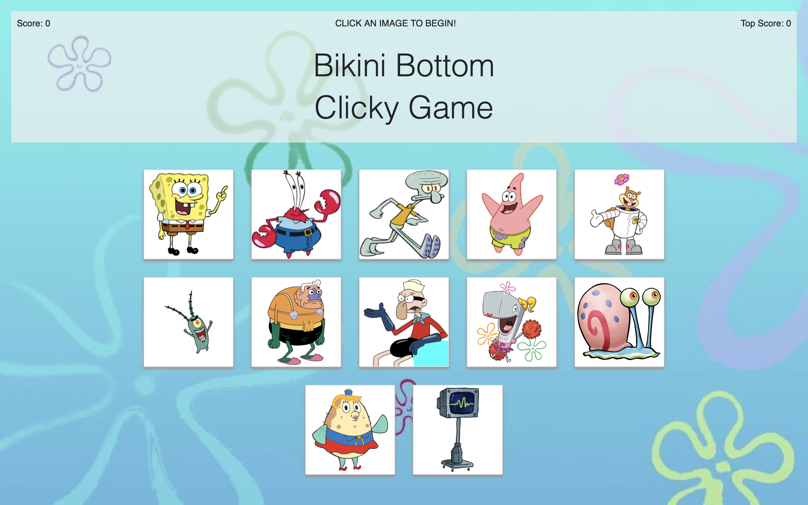

# Bikin Bottom Clicky Game

The goal of the Bikini Bottom Clicky Game is to only click each Spongebob Squarepants character once. To make this more challenging, the images shuffle on each click, so the user has to remember which characters they have already clicked.

React.js was used to create this memory game.

